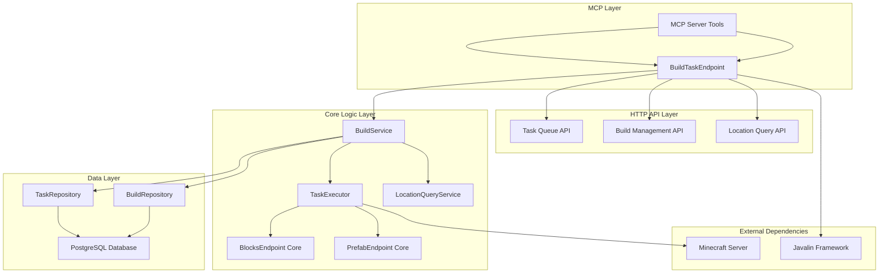

# Design Document: Build Task Management System

## Overview

The Build Task Management System extends the existing Minecraft mod API to provide persistent, queued building operations. The system allows LLMs to create builds, queue tasks, execute them programmatically, and query completed builds by location for future refinement.

The design integrates with the existing Javalin API server and leverages current BlocksEndpoint and PrefabEndpoint functionality while adding PostgreSQL persistence and task queue management.

## Architecture

### System Components



### Database Schema

```sql
-- Builds table: stores build metadata
CREATE TABLE builds (
    id UUID PRIMARY KEY DEFAULT gen_random_uuid(),
    name VARCHAR(255),
    description TEXT,
    status VARCHAR(50) NOT NULL DEFAULT 'created',
    created_at TIMESTAMP WITH TIME ZONE DEFAULT NOW(),
    completed_at TIMESTAMP WITH TIME ZONE,
    world VARCHAR(255) NOT NULL DEFAULT 'minecraft:overworld'
);

-- Build tasks table: stores individual building operations
CREATE TABLE build_tasks (
    id UUID PRIMARY KEY DEFAULT gen_random_uuid(),
    build_id UUID NOT NULL REFERENCES builds(id) ON DELETE CASCADE,
    task_order INTEGER NOT NULL,
    task_type VARCHAR(50) NOT NULL,
    task_data JSONB NOT NULL,
    status VARCHAR(50) NOT NULL DEFAULT 'queued',
    executed_at TIMESTAMP WITH TIME ZONE,
    error_message TEXT,
    
    -- Coordinate tracking for location queries
    min_x INTEGER,
    min_y INTEGER,
    min_z INTEGER,
    max_x INTEGER,
    max_y INTEGER,
    max_z INTEGER,
    
    UNIQUE(build_id, task_order)
);

-- Indexes for efficient querying
CREATE INDEX idx_builds_status ON builds(status);
CREATE INDEX idx_builds_world ON builds(world);
CREATE INDEX idx_tasks_build_id ON build_tasks(build_id);
CREATE INDEX idx_tasks_status ON build_tasks(status);
CREATE INDEX idx_tasks_coordinates ON build_tasks(min_x, min_y, min_z, max_x, max_y, max_z);
CREATE INDEX idx_tasks_location_query ON build_tasks USING GIST (
    box(point(min_x, min_z), point(max_x, max_z))
);
```

## Components and Interfaces

### BuildTaskEndpoint

HTTP endpoint handler extending APIEndpoint pattern:

```java
public class BuildTaskEndpoint extends APIEndpoint {
    private final BuildService buildService;
    
    // POST /api/builds - Create new build
    // GET /api/builds/{id} - Get build details
    // POST /api/builds/{id}/tasks - Add task to build
    // GET /api/builds/{id}/tasks - Get build task queue
    // PUT /api/builds/{id}/tasks - Update task queue
    // POST /api/builds/{id}/execute - Execute build
    // POST /api/builds/query-location - Query builds by location
}
```

### BuildService

Core business logic for build management:

```java
public class BuildService {
    private final BuildRepository buildRepository;
    private final TaskRepository taskRepository;
    private final TaskExecutor taskExecutor;
    private final LocationQueryService locationQueryService;
    
    public Build createBuild(CreateBuildRequest request);
    public Build getBuild(UUID buildId);
    public void addTask(UUID buildId, BuildTask task);
    public List<BuildTask> getTasks(UUID buildId);
    public void updateTaskQueue(UUID buildId, List<BuildTask> tasks);
    public BuildExecutionResult executeBuild(UUID buildId);
    public List<Build> queryBuildsByLocation(LocationQuery query);
}
```

### TaskExecutor

Executes build tasks using refactored endpoint methods:

```java
public class TaskExecutor {
    private final BlocksEndpointCore blocksCore;
    private final PrefabEndpointCore prefabCore;
    private final MinecraftServer server;
    
    public TaskExecutionResult executeTask(BuildTask task);
    private TaskExecutionResult executeBlockTask(BlockTaskData data);
    private TaskExecutionResult executePrefabTask(PrefabTaskData data);
}
```

### MCP Server Integration

The MCP server (`mcp/minecraft_mcp.py`) will be extended with new tools for build task management:

```python
# New MCP tools to be added to MinecraftMCPServer.list_tools()
Tool(
    name="create_build",
    description="Create a new build with metadata for organizing building tasks",
    inputSchema={
        "type": "object",
        "properties": {
            "name": {"type": "string", "description": "Build name"},
            "description": {"type": "string", "description": "Build description"},
            "world": {"type": "string", "default": "minecraft:overworld"}
        },
        "required": ["name"]
    }
),
Tool(
    name="add_build_task",
    description="Add a building task to a build queue",
    inputSchema={
        "type": "object", 
        "properties": {
            "build_id": {"type": "string", "description": "Build UUID"},
            "task_type": {"type": "string", "enum": ["BLOCK_SET", "BLOCK_FILL", "PREFAB_DOOR", "PREFAB_STAIRS", "PREFAB_WINDOW", "PREFAB_TORCH", "PREFAB_SIGN"]},
            "task_data": {"type": "object", "description": "Task-specific parameters"}
        },
        "required": ["build_id", "task_type", "task_data"]
    }
),
Tool(
    name="execute_build",
    description="Execute all queued tasks in a build",
    inputSchema={
        "type": "object",
        "properties": {
            "build_id": {"type": "string", "description": "Build UUID"}
        },
        "required": ["build_id"]
    }
),
Tool(
    name="query_builds_by_location", 
    description="Find builds that intersect with a specified area",
    inputSchema={
        "type": "object",
        "properties": {
            "min_x": {"type": "integer"}, "min_y": {"type": "integer"}, "min_z": {"type": "integer"},
            "max_x": {"type": "integer"}, "max_y": {"type": "integer"}, "max_z": {"type": "integer"},
            "world": {"type": "string", "default": "minecraft:overworld"},
            "include_in_progress": {"type": "boolean", "default": false}
        },
        "required": ["min_x", "min_y", "min_z", "max_x", "max_y", "max_z"]
    }
),
Tool(
    name="get_build_status",
    description="Get build details, status, and task information",
    inputSchema={
        "type": "object",
        "properties": {
            "build_id": {"type": "string", "description": "Build UUID"}
        },
        "required": ["build_id"]
    }
)
```

Each MCP tool will make HTTP requests to the corresponding BuildTaskEndpoint routes and format responses appropriately for LLM consumption.

### Refactored Endpoint Cores

Extract core functionality from existing endpoints:

```java
// BlocksEndpoint refactored to support both HTTP and programmatic calls
public class BlocksEndpoint extends APIEndpoint {
    private final BlocksEndpointCore core;
    
    // HTTP handlers delegate to core methods
    private void handleBlockSet(Context ctx) {
        BlockSetRequest req = ctx.bodyAsClass(BlockSetRequest.class);
        CompletableFuture<BlockSetResult> result = core.setBlocks(req);
        // Handle async response...
    }
}

public class BlocksEndpointCore {
    public CompletableFuture<BlockSetResult> setBlocks(BlockSetRequest request);
    public CompletableFuture<ChunkResult> getChunk(ChunkRequest request);
    public CompletableFuture<FillResult> fillBox(FillBoxRequest request);
    public CompletableFuture<HeightmapResult> getHeightmap(HeightmapRequest request);
}
```

## Data Models

### Build Task Types

```java
public enum TaskType {
    BLOCK_SET,      // Uses BlocksEndpoint.setBlocks
    BLOCK_FILL,     // Uses BlocksEndpoint.fillBox
    PREFAB_DOOR,    // Uses PrefabEndpoint.door
    PREFAB_STAIRS,  // Uses PrefabEndpoint.stairs
    PREFAB_WINDOW,  // Uses PrefabEndpoint.windowPane
    PREFAB_TORCH,   // Uses PrefabEndpoint.torch
    PREFAB_SIGN     // Uses PrefabEndpoint.sign
}

public class BuildTask {
    private UUID id;
    private UUID buildId;
    private int taskOrder;
    private TaskType taskType;
    private JsonNode taskData;  // Stores request data as JSON
    private TaskStatus status;
    private Instant executedAt;
    private String errorMessage;
    private BoundingBox coordinates;
}

public class BoundingBox {
    private int minX, minY, minZ;
    private int maxX, maxY, maxZ;
    
    public boolean intersects(BoundingBox other);
    public static BoundingBox fromBlockSetRequest(BlockSetRequest request);
    public static BoundingBox fromPrefabRequest(Object request);
}
```

### API Request/Response Models

```java
public class CreateBuildRequest {
    public String name;
    public String description;
    public String world = "minecraft:overworld";
}

public class AddTaskRequest {
    public TaskType taskType;
    public JsonNode taskData;  // Contains the specific endpoint request data
}

public class LocationQueryRequest {
    public String world = "minecraft:overworld";
    public int minX, minY, minZ;
    public int maxX, maxY, maxZ;
    public boolean includeInProgress = false;
}

public class BuildExecutionResult {
    public UUID buildId;
    public boolean success;
    public int tasksExecuted;
    public int tasksFailed;
    public List<TaskExecutionResult> taskResults;
    public String errorMessage;
}
```

## Correctness Properties

*A property is a characteristic or behavior that should hold true across all valid executions of a system-essentially, a formal statement about what the system should do. Properties serve as the bridge between human-readable specifications and machine-verifiable correctness guarantees.*

After analyzing the acceptance criteria, the following properties have been identified for property-based testing:

### Property 1: Build ID Uniqueness
*For any* number of build creation requests, all generated build IDs should be unique across the system
**Validates: Requirements 1.1**

### Property 2: Build Persistence Round Trip
*For any* valid build creation request, creating a build and then querying it should return equivalent build metadata
**Validates: Requirements 1.2, 1.3**

### Property 3: Build Metadata Completeness
*For any* created build, the build object should contain name, description, creation timestamp, and status fields
**Validates: Requirements 1.4**

### Property 4: Task Queue Ordering
*For any* sequence of task additions to a build, retrieving the task queue should return tasks in the same order they were added
**Validates: Requirements 2.1, 2.3**

### Property 5: Task Validation Consistency
*For any* task data, the validation result should be consistent with the corresponding endpoint's validation rules
**Validates: Requirements 2.2**

### Property 6: Task Queue Persistence
*For any* task queue modifications, the changes should be reflected when querying the queue from the database
**Validates: Requirements 2.5**

### Property 7: Task Execution Ordering
*For any* build with multiple tasks, execution should process tasks in the same order as they appear in the queue
**Validates: Requirements 3.1**

### Property 8: Task Status Tracking
*For any* executed task, the task status should accurately reflect the execution outcome (completed or failed)
**Validates: Requirements 3.2, 3.3**

### Property 9: Build Completion Status
*For any* build where all tasks have completed status, the build status should be marked as completed
**Validates: Requirements 3.4**

### Property 10: Endpoint Integration Equivalence
*For any* valid task data, executing through TaskExecutor should produce the same world changes as calling the endpoint directly
**Validates: Requirements 3.5**

### Property 11: Location Query Intersection
*For any* location query, all returned builds should have at least one task that intersects with the query area
**Validates: Requirements 4.1**

### Property 12: Location Query Completeness
*For any* location query result, each returned build should include complete metadata and task details
**Validates: Requirements 4.2**

### Property 13: Coordinate Tracking Completeness
*For any* executed task, coordinate information should be stored and retrievable from the database
**Validates: Requirements 4.3**

### Property 14: Overlapping Build Chronological Order
*For any* location query that returns multiple builds, the builds should be ordered by creation timestamp
**Validates: Requirements 4.4**

### Property 15: Database Error Handling
*For any* database operation failure, the system should return appropriate error messages without crashing
**Validates: Requirements 5.4**

### Property 16: API Error Response Consistency
*For any* invalid API request, the response should include descriptive error messages and appropriate HTTP status codes
**Validates: Requirements 6.4**

### Property 17: API Pattern Consistency
*For any* new build task endpoint, the request/response format should follow existing endpoint conventions
**Validates: Requirements 6.5**

### Property 18: Endpoint Refactoring Compatibility
*For any* existing endpoint functionality, the refactored version should produce identical results when called programmatically
**Validates: Requirements 7.1, 7.2, 7.3, 7.4, 7.5**

### Property 19: MCP Build Creation Tool
*For any* valid build creation request through MCP, the tool should create a build with the same metadata as direct HTTP API calls
**Validates: Requirements 8.1**

### Property 20: MCP Task Addition Tool
*For any* valid task addition request through MCP, the tool should add tasks to the build queue identically to direct HTTP API calls
**Validates: Requirements 8.2**

### Property 21: MCP Build Execution Tool
*For any* build execution request through MCP, the tool should execute builds and return status identically to direct HTTP API calls
**Validates: Requirements 8.3**

### Property 22: MCP Location Query Tool
*For any* location query request through MCP, the tool should return builds that intersect the area identically to direct HTTP API calls
**Validates: Requirements 8.4**

### Property 23: MCP Build Status Tool
*For any* build status request through MCP, the tool should return complete build information identically to direct HTTP API calls
**Validates: Requirements 8.5**

### Property 24: MCP HTTP API Delegation
*For any* MCP tool operation, the result should be equivalent to calling the corresponding HTTP API endpoint directly
**Validates: Requirements 8.6**

### Property 25: MCP Error Message Descriptiveness
*For any* MCP tool call that fails, the error message should contain sufficient detail for debugging and user understanding
**Validates: Requirements 8.7**

### Property 26: Existing API Functionality Preservation
*For any* existing API endpoint, functionality should remain unchanged after build task system integration
**Validates: Requirements 9.4**

<function_calls>
<invoke name="prework">
<parameter name="featureName">build-task-management

## Error Handling

### Database Connection Failures
- Implement connection pooling with retry logic
- Graceful degradation when database is unavailable
- Clear error messages for database connectivity issues

### Task Execution Failures
- Individual task failures should not stop build execution
- Failed tasks marked with detailed error information
- Build continues with remaining tasks after failures
- Summary report includes both successful and failed operations

### API Error Responses
- Consistent HTTP status codes (400 for client errors, 500 for server errors)
- Structured error response format matching existing endpoints
- Detailed error messages for debugging
- Input validation errors with field-specific feedback

### Minecraft Server Integration Errors
- Handle server thread execution timeouts
- Manage world loading/unloading scenarios
- Coordinate validation against world boundaries
- Block placement failures due to world protection

## Testing Strategy

### Unit Testing Approach
- **Core Logic Testing**: Test BuildService, TaskExecutor, and repository classes in isolation
- **Validation Testing**: Verify task data validation against endpoint schemas
- **Error Handling Testing**: Test error scenarios and exception handling
- **Database Operations**: Test repository methods with in-memory database

### Property-Based Testing Configuration
- **Framework**: Use JUnit 5 with jqwik for property-based testing
- **Test Iterations**: Minimum 100 iterations per property test
- **Data Generation**: Custom generators for build data, task data, and coordinate ranges
- **Property Test Tags**: Each test tagged with format "Feature: build-task-management, Property N: [property description]"

### Integration Testing Strategy
- **Database Integration**: Test with real PostgreSQL instance using Testcontainers
- **Endpoint Integration**: Test HTTP endpoints with embedded Javalin server
- **MCP Integration**: Test MCP tools against running HTTP API server
- **Minecraft Integration**: Test with mock MinecraftServer for world operations
- **End-to-End Flows**: Test complete build creation → task addition → execution → query workflows

### Compatibility Testing
- **Existing Endpoint Preservation**: Verify all existing API endpoints continue to work unchanged
- **Refactoring Validation**: Ensure refactored endpoint cores produce identical results
- **MCP Tool Equivalence**: Verify MCP tools produce identical results to direct HTTP API calls
- **Performance Regression**: Monitor response times for existing endpoints
- **Data Migration**: Test database schema initialization and upgrades

### Test Organization
```
src/test/java/com/example/
├── buildtask/
│   ├── service/
│   │   ├── BuildServiceTest.java           # Unit tests
│   │   ├── TaskExecutorTest.java          # Unit tests
│   │   └── BuildServicePropertyTest.java   # Property-based tests
│   ├── repository/
│   │   ├── BuildRepositoryTest.java       # Integration tests
│   │   └── TaskRepositoryTest.java        # Integration tests
│   ├── endpoint/
│   │   ├── BuildTaskEndpointTest.java     # HTTP endpoint tests
│   │   └── EndpointCompatibilityTest.java # Compatibility tests
│   ├── mcp/
│   │   └── MCPIntegrationTest.java        # MCP tool tests
│   └── integration/
│       └── BuildTaskSystemIntegrationTest.java # End-to-end tests
└── endpoints/
    ├── BlocksEndpointCompatibilityTest.java    # Refactoring tests
    └── PrefabEndpointCompatibilityTest.java    # Refactoring tests
```

### Property Test Examples
```java
@Property
@Tag("Feature: build-task-management, Property 1: Build ID Uniqueness")
void buildIdsAreAlwaysUnique(@ForAll("buildRequests") List<CreateBuildRequest> requests) {
    List<UUID> buildIds = requests.stream()
        .map(buildService::createBuild)
        .map(Build::getId)
        .collect(toList());
    
    assertThat(buildIds).doesNotHaveDuplicates();
}

@Property  
@Tag("Feature: build-task-management, Property 4: Task Queue Ordering")
void taskQueuePreservesOrder(@ForAll("taskLists") List<BuildTask> tasks) {
    UUID buildId = buildService.createBuild(validBuildRequest()).getId();
    
    tasks.forEach(task -> buildService.addTask(buildId, task));
    List<BuildTask> retrieved = buildService.getTasks(buildId);
    
    assertThat(retrieved).containsExactlyElementsOf(tasks);
}

@Property
@Tag("Feature: build-task-management, Property 24: MCP HTTP API Delegation")
void mcpToolsProduceSameResultsAsHttpApi(@ForAll("buildRequests") CreateBuildRequest request) {
    // Create build via HTTP API
    Build httpBuild = buildService.createBuild(request);
    
    // Create build via MCP tool (simulated)
    CallToolResult mcpResult = mcpServer.callTool("create_build", Map.of(
        "name", request.getName(),
        "description", request.getDescription(),
        "world", request.getWorld()
    ));
    
    // Extract build ID from MCP response and verify equivalence
    UUID mcpBuildId = extractBuildIdFromMcpResponse(mcpResult);
    Build mcpBuild = buildService.getBuild(mcpBuildId);
    
    assertThat(mcpBuild.getName()).isEqualTo(httpBuild.getName());
    assertThat(mcpBuild.getDescription()).isEqualTo(httpBuild.getDescription());
    assertThat(mcpBuild.getWorld()).isEqualTo(httpBuild.getWorld());
}
```