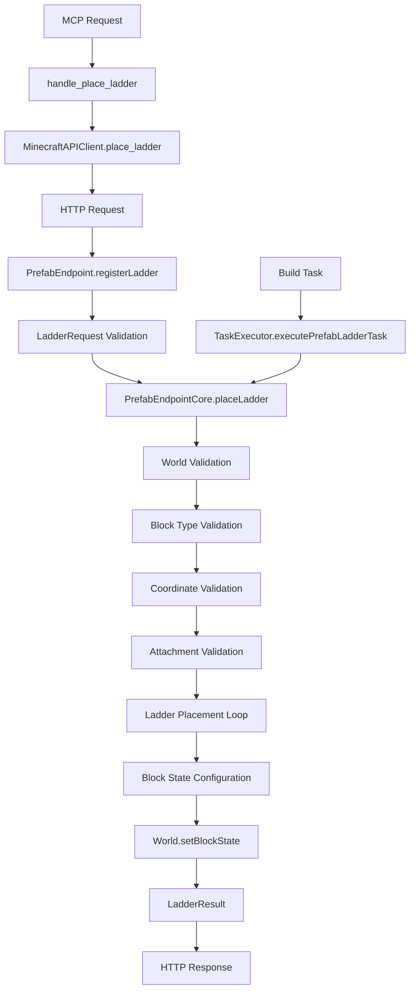

# Design Document: Prefab Ladder Endpoint

## Overview

This design document specifies the implementation of a new prefab ladder endpoint for the Minecraft Fabric mod API server. The feature will integrate seamlessly with the existing prefab system architecture, providing REST API access for programmatic ladder placement, build task system integration, and MCP server support.

The ladder system will follow established patterns from existing prefab endpoints (doors, stairs, windows, torches, signs) while providing ladder-specific functionality for vertical structure placement with proper attachment validation and orientation handling.

## Architecture

The ladder endpoint follows the established three-layer architecture:

1. **HTTP Layer**: `PrefabEndpoint.registerLadder()` - Handles HTTP requests, parameter validation, and response formatting
2. **Core Logic Layer**: `PrefabEndpointCore.placeLadder()` - Contains business logic for ladder placement and world interaction
3. **Integration Layer**: Build task system and MCP server integration for workflow automation

### Component Interaction Flow



## Components and Interfaces

### 1. LadderRequest Class

```java
class LadderRequest {
    public String world;           // optional, defaults to overworld
    public int x;                  // ladder base X coordinate
    public int y;                  // ladder base Y coordinate  
    public int z;                  // ladder base Z coordinate
    public int height;             // number of ladder blocks to place vertically
    public String block_type;      // ladder block identifier (e.g., "minecraft:ladder")
    public String facing;          // optional - direction ladder faces ("north", "south", "east", "west")
}
```

### 2. LadderResult Record

```java
record LadderResult(
    boolean success,
    String error,
    String world,
    int blocks_placed,
    String facing,
    Map<String, Integer> start_position,
    Map<String, Integer> end_position
) {}
```

### 3. PrefabEndpoint Integration

```java
private void registerLadder() {
    app.post("/api/world/prefabs/ladder", ctx -> {
        LadderRequest req = ctx.bodyAsClass(LadderRequest.class);
        
        CompletableFuture<LadderResult> future = core.placeLadder(req);
        
        try {
            LadderResult result = future.get(10, TimeUnit.SECONDS);
            if (!result.success()) {
                ctx.status(500).json(Map.of("error", result.error()));
            } else {
                ctx.json(Map.of(
                    "success", true,
                    "world", result.world(),
                    "blocks_placed", result.blocks_placed(),
                    "facing", result.facing(),
                    "start_position", result.start_position(),
                    "end_position", result.end_position()
                ));
            }
        } catch (TimeoutException e) {
            ctx.status(500).json(Map.of("error", "Timeout waiting for ladder placement"));
        } catch (Exception e) {
            ctx.status(500).json(Map.of("error", "Unexpected error: " + e.getMessage()));
        }
    });
}
```

### 4. PrefabEndpointCore Integration

```java
public CompletableFuture<LadderResult> placeLadder(LadderRequest request) {
    CompletableFuture<LadderResult> future = new CompletableFuture<>();
    
    // Validation logic
    // World validation
    // Block type validation
    // Coordinate validation
    
    server.execute(() -> {
        try {
            // Ladder placement logic
            // Attachment validation
            // Block state configuration
            // Placement loop
            
            future.complete(new LadderResult(/* success result */));
        } catch (Exception e) {
            future.complete(new LadderResult(false, e.getMessage(), null, 0, null, null, null));
        }
    });
    
    return future;
}
```

## Data Models

### Ladder Placement Parameters

- **Position**: 3D coordinates (x, y, z) for ladder base
- **Height**: Vertical extent of ladder structure (positive integer)
- **Block Type**: Minecraft block identifier for ladder material
- **Facing Direction**: Orientation for ladder attachment (north/south/east/west)
- **World**: Target world for placement (defaults to overworld)

### Ladder Block State Properties

Ladder blocks in Minecraft have the following properties:
- `facing`: Direction the ladder faces (NORTH, SOUTH, EAST, WEST)
- `waterlogged`: Whether the ladder block contains water (boolean)

### Attachment Validation Logic

Ladders must attach to solid blocks. The validation algorithm:
1. Check the block in the facing direction for solidity
2. If no facing specified, auto-detect by checking all horizontal directions
3. Prefer directions with solid blocks for the entire ladder height
4. Fall back to any available solid block if full-height attachment unavailable

## Correctness Properties

*A property is a characteristic or behavior that should hold true across all valid executions of a system-essentially, a formal statement about what the system should do. Properties serve as the bridge between human-readable specifications and machine-verifiable correctness guarantees.*

Before defining the correctness properties, I need to analyze the acceptance criteria from the requirements document to determine which ones are testable as properties.

### Property 1: Ladder Structure Placement Accuracy
*For any* valid ladder placement request with specified coordinates and height, the system should place exactly the requested number of ladder blocks in a vertical line starting from the specified position.
**Validates: Requirements 1.1, 1.2, 2.1**

### Property 2: Ladder Attachment Validation
*For any* ladder structure placement, all placed ladder blocks should have valid attachment to adjacent solid blocks in the specified or auto-detected facing direction.
**Validates: Requirements 1.3, 3.1, 3.2**

### Property 3: Block Replacement Consistency
*For any* ladder placement request, existing blocks at target positions should be replaced with ladder blocks of the specified type, and the system should report accurate placement counts.
**Validates: Requirements 1.4, 3.3**

### Property 4: Facing Direction Handling
*For any* ladder placement with specified facing direction, all ladder blocks should be oriented to face that direction; for requests without facing direction, the system should auto-detect and use a consistent facing direction based on available solid block attachments.
**Validates: Requirements 2.3, 2.4**

### Property 5: Height Limit Handling
*For any* ladder placement request that would exceed world height limits, the system should truncate the ladder at the world height limit and report the actual number of blocks placed.
**Validates: Requirements 3.5**

### Property 6: Response Format Consistency
*For any* ladder placement request (successful or failed), the response should use snake_case field names and follow the same JSON structure format as other prefab endpoints.
**Validates: Requirements 6.1, 6.2, 6.4, 8.5**

### Property 7: Success Response Completeness
*For any* successful ladder placement, the response should contain success status, world name, blocks_placed count, facing direction, start_position, and end_position fields.
**Validates: Requirements 4.3, 6.3, 9.2**

### Property 8: Bounding Box Calculation Accuracy
*For any* ladder structure with given coordinates and height, the calculated bounding box should exactly encompass all ladder block positions with correct min/max coordinates.
**Validates: Requirements 7.4**

### Property 9: Parameter Validation Consistency
*For any* invalid ladder placement request (invalid coordinates, block types, or world names), the system should reject the request with appropriate error messages and HTTP status codes.
**Validates: Requirements 4.2, 7.2, 8.4**

### Property 10: MCP Parameter Mapping
*For any* ladder placement request through MCP, the parameters should be correctly mapped to the underlying API endpoint with no data loss or transformation errors.
**Validates: Requirements 8.2, 8.4**

## Error Handling

### Validation Errors
- **Invalid Coordinates**: Return HTTP 400 with descriptive error message
- **Invalid Block Type**: Return HTTP 400 with block validation error
- **Invalid World**: Return HTTP 400 with world validation error
- **Invalid Height**: Return HTTP 400 for non-positive height values

### Runtime Errors
- **World Access Failure**: Return HTTP 500 with world access error
- **Block Placement Failure**: Return HTTP 500 with placement error details
- **Attachment Validation Failure**: Return HTTP 400 with attachment error explanation
- **Timeout**: Return HTTP 500 with timeout error message

### Error Response Format
All errors follow the established pattern:
```json
{
    "error": "Descriptive error message"
}
```

## Testing Strategy

### Dual Testing Approach
The ladder endpoint will use both unit testing and property-based testing for comprehensive coverage:

**Unit Tests**:
- Specific examples of ladder placement scenarios
- Edge cases like world height limits and attachment failures
- Integration points between HTTP layer and core logic
- Error condition handling for invalid inputs

**Property-Based Tests**:
- Universal properties across all valid ladder configurations
- Randomized testing of coordinates, heights, materials, and orientations
- Comprehensive input coverage through automated generation
- Each property test runs minimum 100 iterations for thorough validation

**Property Test Configuration**:
The implementation will use JUnit 5 with jqwik for property-based testing in Java. Each correctness property will be implemented as a separate property-based test with the following tag format:
- **Feature: prefab-ladder, Property 1: Ladder Structure Placement Accuracy**
- **Feature: prefab-ladder, Property 2: Ladder Attachment Validation**
- And so on for each property

**Integration Testing**:
- Extension of existing `test_api.py` framework with ladder-specific test cases
- End-to-end testing through HTTP endpoints
- Build task system integration testing
- MCP server integration testing

### Test Data Generation
Property tests will generate:
- Random valid coordinates within world bounds
- Random ladder heights (1-256 blocks)
- Random valid ladder block types
- Random facing directions (north, south, east, west)
- Random world configurations with varying solid block placements

### Test Environment
- Use test worlds to avoid affecting production data
- Isolated test execution with proper cleanup
- Consistent world state setup for reproducible tests
- Integration with existing Gradle test infrastructure